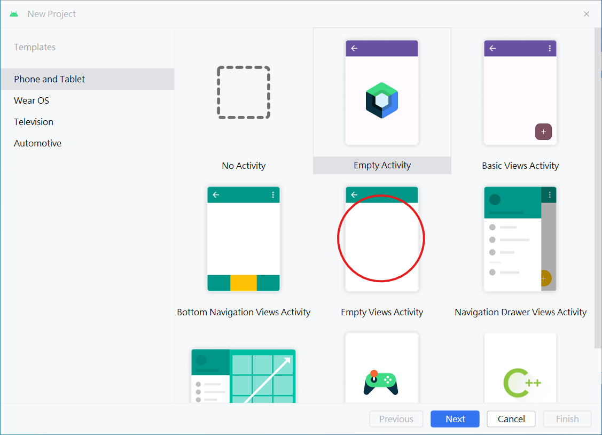
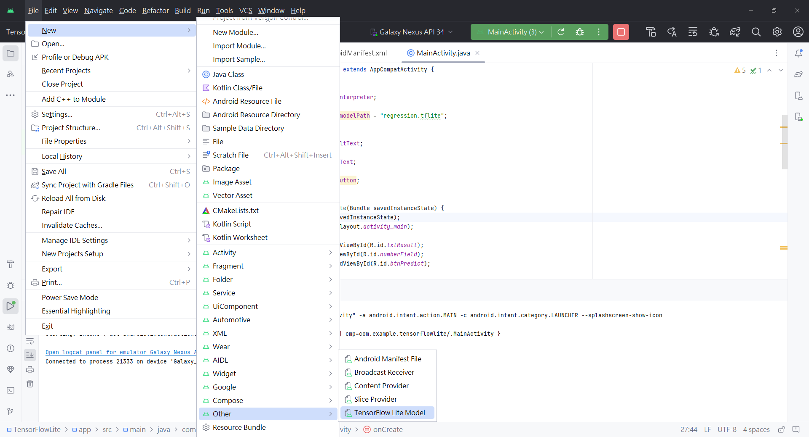
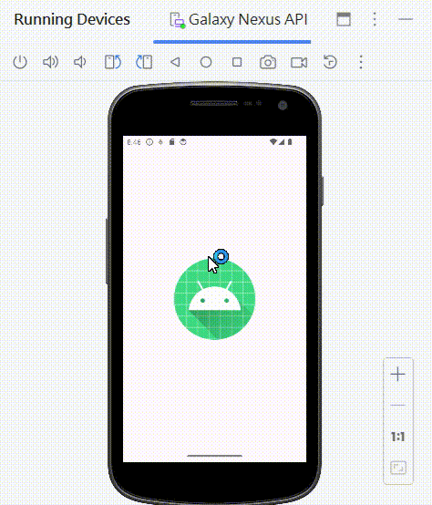

## 標題：在手機上使用 TensorFlow Lite 實現機器學習應用

### 1. **簡介**
機器學習的應用不再僅限於大型伺服器和雲端環境，如今，在手機上運行機器學習模型已成為現實。TensorFlow Lite 是一個針對行動裝置和嵌入式裝置的輕量級解決方案，它不僅提供卓越的效能，還允許在無網路環境下執行。本文將帶您深入了解如何在 Android 手機上部署和整合 TensorFlow Lite 模型。
讓我們開始探索 TensorFlow Lite 的奇妙世界，將機器學習的力量帶入您的手機應用！

### 2. **TensorFlow Lite 簡介**

TensorFlow Lite（TFLite）是針對行動裝置和嵌入式裝置的輕量級機器學習解決方案。它繼承了 TensorFlow 的強大功能，同時針對資源受限的環境進行了優化。以下是 TensorFlow Lite 的一些關鍵特點：

#### 2.1 輕量化和高效

TensorFlow Lite 採用了精簡的位元大小和高效的運算方式，使其能夠在手機等設備上達到卓越的性能。這不僅加速了推理過程，還減小了模型的儲存和運行開銷。

#### 2.2 離線執行

一個重要的優勢是 TensorFlow Lite 可以在無網路連接的狀態下執行。這使得應用在各種環境中都能保持穩定運行，而不受網路限制。

#### 2.3 支援多種終端設備

TensorFlow Lite 提供了針對 Android、iOS 等終端設備的支援，這意味著您可以在不同平台上部署相同的模型，實現跨設備的應用。
在接下來的章節中，我們將深入探討如何使用 TensorFlow Lite，包括模型的訓練、封裝、部署和測試。

### 3. **訓練 TensorFlow 模型**

#### 3.1 建立資料集

建立簡單的乘法器，每個輸入對應著輸入的兩倍輸出。使用 numpy 生成 500 筆資料，X 為輸入，$y = 2 \cdot X$。


```python
import numpy as np

X = np.arange(1, 500, 1)
y = np.arange(2, 1000, 2)
```

#### 3.2 搭建訓練神經網路模型


```python
from tensorflow import keras
from tensorflow.keras import Sequential
from tensorflow.keras.layers import Dense

model = Sequential([Dense(1, input_shape=[1])])
model.compile(optimizer=keras.optimizers.Adam(learning_rate=2), loss=keras.losses.mean_squared_error)
model.fit(X, y, epochs=50)
```

#### 4. **測試模型**


```python
model.predict([10])
```

    1/1 [==============================] - 0s 115ms/step
    


    array([[20.001377]], dtype=float32)


#### 5. **模型轉換成 .tflite**


```python
import tensorflow as tf


# 保存模型為 .h5 格式
model.save('regression.h5')

# 載入模型
loaded_model = tf.keras.models.load_model('regression.h5')

# 轉換模型為 TensorFlow Lite 格式
converter = tf.lite.TFLiteConverter.from_keras_model(loaded_model)
converter.optimizations = [tf.lite.Optimize.DEFAULT]
tflite_model = converter.convert()

# 將 TensorFlow Lite 模型寫入檔案
open("regression.tflite", "wb").write(tflite_model)

```

    INFO:tensorflow:Assets written to: C:\Users\B20770\AppData\Local\Temp\tmpahzus893\assets
    

    INFO:tensorflow:Assets written to: C:\Users\B20770\AppData\Local\Temp\tmpahzus893\assets
    


    1084


#### 6.測試儲存好的模型


```python
import tensorflow as tf
import numpy as np

# 載入 TensorFlow Lite 模型
interpreter = tf.lite.Interpreter(model_path='regression.tflite')
interpreter.allocate_tensors()

# 取得輸入和輸出的索引
input_index = interpreter.get_input_details()[0]["index"]
output_index = interpreter.get_output_details()[0]["index"]

# 輸入一個數字進行推論
input_data = np.array([[100]], dtype=np.float32)
interpreter.set_tensor(input_index, input_data)
interpreter.invoke()

# 取得推論結果並輸出
print(interpreter.get_tensor(output_index))

```

    [[200.0008]]
    

#### 7. **在 Android 上部署 TensorFlow Lite 模型**

- 1. 開啟空白專案



- 2. File >> New >> other >> Tensorflow lite model，然後能勾選的都勾起來並且按下finish



- 3. activity_main.xml (UI設計)

```
<?xml version="1.0" encoding="utf-8"?>
<androidx.constraintlayout.widget.ConstraintLayout xmlns:android="http://schemas.android.com/apk/res/android"
    xmlns:app="http://schemas.android.com/apk/res-auto"
    xmlns:tools="http://schemas.android.com/tools"
    android:layout_width="match_parent"
    android:layout_height="match_parent"
    tools:context=".MainActivity">

    <EditText
        android:id="@+id/numberField"
        android:layout_width="wrap_content"
        android:layout_height="wrap_content"
        android:ems="10"
        android:inputType="number"
        app:layout_constraintBottom_toTopOf="@+id/guideline"
        app:layout_constraintEnd_toEndOf="parent"
        app:layout_constraintStart_toStartOf="parent" />

    <androidx.constraintlayout.widget.Guideline
        android:id="@+id/guideline"
        android:layout_width="wrap_content"
        android:layout_height="wrap_content"
        android:orientation="horizontal"
        app:layout_constraintGuide_percent="0.5" />

    <Button
        android:id="@+id/btnPredict"
        android:layout_width="wrap_content"
        android:layout_height="wrap_content"
        android:layout_marginTop="16dp"
        android:text="Predict"
        app:layout_constraintEnd_toEndOf="@+id/numberField"
        app:layout_constraintStart_toStartOf="@+id/numberField"
        app:layout_constraintTop_toBottomOf="@+id/numberField" />

    <TextView
        android:id="@+id/txtResult"
        android:layout_width="wrap_content"
        android:layout_height="wrap_content"
        android:layout_marginTop="32dp"
        android:fontFamily="sans-serif-black"
        android:textColor="@android:color/black"
        android:textSize="18sp"
        app:layout_constraintEnd_toEndOf="@+id/btnPredict"
        app:layout_constraintStart_toStartOf="@+id/btnPredict"
        app:layout_constraintTop_toBottomOf="@+id/btnPredict" />
</androidx.constraintlayout.widget.ConstraintLayout>
```
- 4. AndroidMainifest.xml

```
<?xml version="1.0" encoding="utf-8"?>
<manifest xmlns:android="http://schemas.android.com/apk/res/android"
    xmlns:tools="http://schemas.android.com/tools">

    <application
        android:allowBackup="true"
        android:dataExtractionRules="@xml/data_extraction_rules"
        android:fullBackupContent="@xml/backup_rules"
        android:icon="@mipmap/ic_launcher"
        android:label="@string/app_name"
        android:roundIcon="@mipmap/ic_launcher_round"
        android:supportsRtl="true"
        android:theme="@style/Theme.TensorFlowLite"
        tools:targetApi="31">
        <activity
            android:name=".MainActivity"
            android:exported="true">
            <intent-filter>
                <action android:name="android.intent.action.MAIN" />

                <category android:name="android.intent.category.LAUNCHER" />
            </intent-filter>
        </activity>
    </application>

</manifest>
```

- 5. MainActivity.java
```
package com.example.tensorflowlite;

import android.content.res.AssetManager;
import android.os.Bundle;
import android.view.View;
import android.widget.Button;
import android.widget.EditText;
import android.widget.TextView;
import androidx.appcompat.app.AppCompatActivity;
import org.tensorflow.lite.Interpreter;
import java.io.FileInputStream;
import java.io.IOException;
import java.nio.MappedByteBuffer;
import java.nio.channels.FileChannel;

public class MainActivity extends AppCompatActivity {

    private Interpreter interpreter;
    private final String modelPath = "regression.tflite";

    private TextView resultText;
    private EditText editText;
    private Button checkButton;

    @Override
    protected void onCreate(Bundle savedInstanceState) {
        super.onCreate(savedInstanceState);
        setContentView(R.layout.activity_main);

        resultText = findViewById(R.id.txtResult);
        editText = findViewById(R.id.numberField);
        checkButton = findViewById(R.id.btnPredict);

        checkButton.setOnClickListener(new View.OnClickListener() {
            @Override
            public void onClick(View v) {
                float result = doInference(editText.getText().toString());
                resultText.setText(String.valueOf(result));
            }
        });

        initInterpreter();
    }

    private void initInterpreter() {
        Interpreter.Options options = new Interpreter.Options();
        options.setNumThreads(4);
        options.setUseNNAPI(true);
        try {
            interpreter = new Interpreter(loadModelFile(getAssets(), modelPath), options);
        } catch (IOException e) {
            e.printStackTrace();
        }
    }

    private float doInference(String inputString) {
        float inputVal = Float.parseFloat(inputString);
        float[][] input = {{inputVal}};
        float[][] output = new float[1][1];
        interpreter.run(input, output);
        return output[0][0];
    }

    private MappedByteBuffer loadModelFile(AssetManager assetManager, String modelPath) throws IOException {
        FileInputStream fileInputStream = new FileInputStream(assetManager.openFd(modelPath).getFileDescriptor());
        FileChannel fileChannel = fileInputStream.getChannel();
        long startOffset = assetManager.openFd(modelPath).getStartOffset();
        long declaredLength = assetManager.openFd(modelPath).getDeclaredLength();
        return fileChannel.map(FileChannel.MapMode.READ_ONLY, startOffset, declaredLength);
    }
}
```

#### 8. **應用示例**




```python

```
